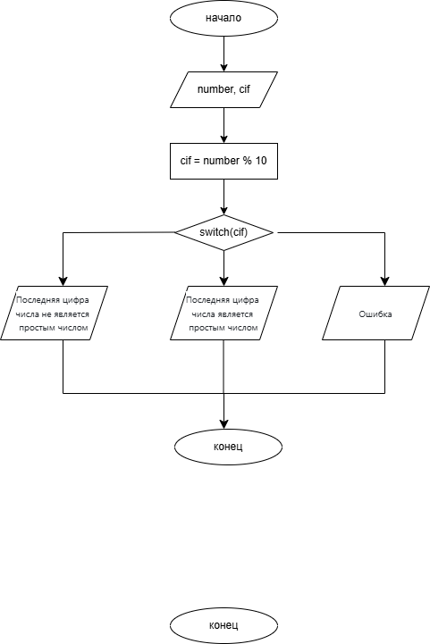

# Домашнее задание к работе 7 
## Условие задачи
Написать программу, которая проверяет, является ли последняя цифра заданного двузначного числа - простым числом
## 1. Алгоритм и блок-схема 
### Алгоритм
1. Начало
2. Инициализировать переменную 
  + `number` - переменная, в которую записывается значение двузначного числа
3. Ввести значение числа с клавиатуры
4. Инициализировать переменную
  + `cif` = `number` % 10 - последняя цифра числа
5. Проверка условия:
  + Если `cif` = 2, 3, 5, 7 - вывести "Последняя цифра числа является простым числом"
  + Если `cif` = 0, 1, 4, 6, 8, 9 - вывести "Последняя цифра числа не является простым числом"
  + Иначе вывести "Ошибка"
6. Конец
### Блок-схема
  
[Ссылка на draw.io](https://viewer.diagrams.net/?tags=%7B%7D&lightbox=1&highlight=0000ff&edit=_blank&layers=1&nav=1&title=lab7scheme.drawio.png&dark=auto#R%3Cmxfile%3E%3Cdiagram%20name%3D%22%D0%A1%D1%82%D1%80%D0%B0%D0%BD%D0%B8%D1%86%D0%B0%20%E2%80%94%201%22%20id%3D%22aj79lTrdRjpPKqFaR-8Q%22%3E7VtZc9s2EP41mkkelOFt%2BVGS5brTJE2q6bTuG0xBFGOQYEnoyq8PTgo8ZB0mFTvmC0UsgCW4%2B32LJZfq2eNo81sKksUnPIOoZxmzTc%2B%2B6VmWaQ1M%2BsMkWyHxPEMIgjScyUE7wTT8DqVQDVuGM5gVBhKMEQmTotDHcQx9UpCBNMXr4rA5RsWrJiCAFcHUB6gq%2FSeckYWUmt71ruMOhsFCXdpzHdETATVa3kq2ADO81kT2pGePU4yJOIs2Y4iY9ZRhxLzbPb35ylIYk2MmXE3v%2B9%2FB4K%2Bv8SZa3f2XOZ%2Bno74ttMBZxQw7tVKU4WXqwyd0qXFkq6zH1E5lE6dkgQMcAzTZSUcpXsYzyFZo0NZuzEeMEyo0qfAbJGQrkQGWBFPRgkRI9sJNSP5l0z%2B4snWv9dxspGbe2MpGbnwKW4gjSNItXXcKESDhqmgHIPET5OPyqV9wSC1kGRLrjiH9vFXYN4oqCEgDSOSsnZ%2FoibaMnYh77wRPPuE4zSEIUeYww68XIYHTBHCPril5i2alfCIgjGGqmcwyVgAtpaYeFY9u%2BNHo0SmDK3VOjyN%2BnMhJMCVwo62oavqFxiBHmm2t0U2ZUmqxnaKpHWO%2FswpmPtWmboPscDp2aC6zjMuywzmGHTRCJ%2ByUjgIIQYSDFETUIglMQ7oAToZC35ddxyFCzcMNVPvbUQSLl9ED7bXGbHcL55fiUiVsNUamQYNk8joy6WQaXJZM3jFkKpr7udsNZ4DBzw3FDHrTNEAbKlVsnxuVoNUYN66PsugCRw%2FLrAFrZuuQ%2BIt31KjvG7OdWbad%2BzRGG7OdWswriu09y0N0paMsAXFhmd7%2FS%2FY4QDUgTGcPWawIHt7ZptgHbFf8OsZ7rpY%2Bz8SkPwdRiLZidB8kCYL9bJsRGInBIxTGj5%2BAP%2BWyW8xiwpizxwMRuxN5zSkMMKTyv38v99SP%2F4xpgLSMKYiz%2Bgl3EK0gCX0gmsM0BEicZnROP6MGnterHrKboPIxN4NlTCL8LTxuVfpd7JnHLUfhTvoAhUEsDJfRmCm0Gg%2FAfwx4%2BOqX%2FGC50gH6iXCFl6%2FKC%2BQvd%2FGc27vGxdx1GQfNkEexZFOviELo%2BlYm1CzRNrUU2%2BVHRyXjtPdWHi2RlXu8a8DPHX40ZJ6urBI%2FZIm2XkpBseTibVCxAGtRPAtXZVGH6Q7ThzGdPzAOKpg2FHYF6C3VlUtcfm6piQLuHZo7NP%2FECD261YLrRIOmgKkYM1bI3gf9iRp2DnqpuAbAZekZ2Z53eqZse61le0e95%2BqyvS6WvNpY0mV7HaZ%2FLUwfzPbyWoLbJX8duF8XuN988me6l0r%2BvNeb%2FHE%2F1OBsP9APQHYO%2FKKmE2KLzkLWLsSK02LDnlhQvkrO9fymDEneG11om3PLtgb7b35vSN7H14bCBUvLBLMHir70KOg7zHOsAwzdw%2BcLUNQ1W6Co%2FXF9ZfyBrNm4%2F%2FXxU3C3WMZ%2F9k3zhDKfVr6LZ0P2uQ5t%2BQhkWegXeVesJjFDKhJaDBWMNFIwoG2qTWv5y3TFp%2FJSXUzvUqvisea9qtyxxq6Ox1vbArFFYe2IYkQhAhxyoIqftWVBzavuE047rlJol6u7otJaqRRWFZVivHXVWsmxHlanfKhUC6sYx7AlTL0ol1cKb9fXH9zznJ5%2FuqbQ095HG%2FVO937lWPJC8HLQyWejpbzHtI2Wqw4traPFHTSEloqiS6PllM%2BR3vSG0pjLHe8nbyfXncvP2xOc8sc75%2B4JTnsfRde6XF2uc%2FnBtJGliVYzXq%2FTdWnHP%2Fsx9K04vhzez%2FZ6RdGlXW51Lr9weD%2BInbZd%2Fuy3Au2m%2FC%2FK6%2BV3QWd7vazIvTTRj%2FozR8N%2FdRpqNZobrRIpX1G08fG5%2B7SVj3hlS5u7%2FxcK8%2B%2F%2BpmlPfgA%3D%3C%2Fdiagram%3E%3C%2Fmxfile%3E)
## 2. Реализация программы 
```C
#define _CRT_SECURE_NO_DEPRECATE
#include <stdio.h>
#include <locale.h>
#include <math.h>

int main()
{
	setlocale(LC_CTYPE, "RUS");
	int number;
	puts("Введите целое двузначное число\n");
	scanf("%d", &number);
	int cif = number % 10;
	switch (cif)
		{
		case 2:
		case 3:
		case 5:
		case 7:
			printf("Последняя цифра числа (%d) является простым числом\n", cif);
			break;
		case 0:
		case 1:
		case 4:
		case 6:
		case 8:
		case 9:
			printf("Последняя цифра числа (%d) не является простым числом\n", cif);
			break;
		default:
			puts("Ошибка\n");
			break;
		}
	return 0;
}
```
## 3. Результат работы программы 
### Последняя цифра - простое число
Введите целое двузначное число  
52  
Последняя цифра числа (2) является простым числом
### Последняя цифра - не простое число
Введите целое двузначное число
24
Последняя цифра числа (4) не является простым числом
## 4. Информация о разработчике 
Вильальба Агния, группа бТИИ-251
