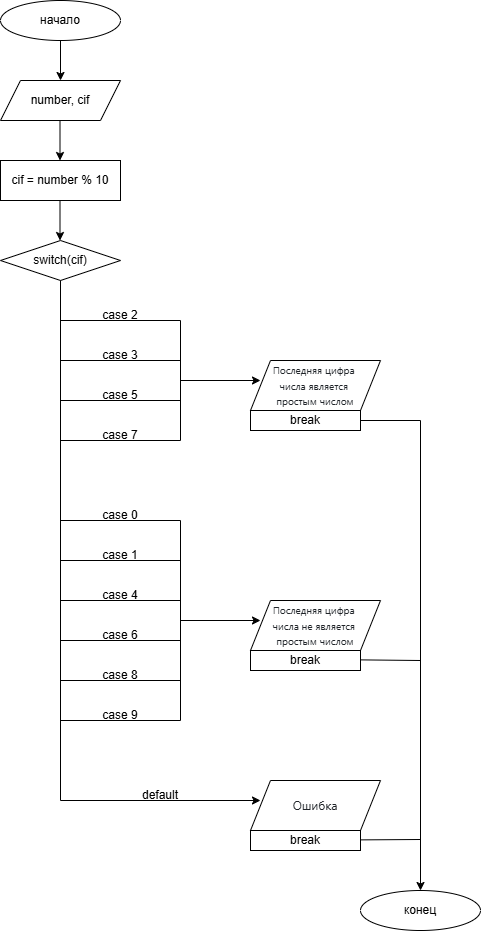

# Домашнее задание к работе 7 
## Условие задачи
Написать программу, которая проверяет, является ли последняя цифра заданного двузначного числа - простым числом
## 1. Алгоритм и блок-схема 
### Алгоритм
1. Начало
2. Инициализировать переменную 
  + `number` - переменная, в которую записывается значение двузначного числа
3. Ввести значение числа с клавиатуры
4. Инициализировать переменную
  + `cif` = `number` % 10 - последняя цифра числа
5. Проверка условия:
  + Если `cif` = 2, 3, 5, 7 - вывести "Последняя цифра числа является простым числом"
  + Если `cif` = 0, 1, 4, 6, 8, 9 - вывести "Последняя цифра числа не является простым числом"
  + Иначе вывести "Ошибка"
6. Конец
### Блок-схема
  
[Ссылка на draw.io](https://viewer.diagrams.net/?tags=%7B%7D&lightbox=1&highlight=0000ff&edit=_blank&layers=1&nav=1&title=scheme7.3.drawio.png&dark=auto#R%3Cmxfile%3E%3Cdiagram%20name%3D%22%D0%A1%D1%82%D1%80%D0%B0%D0%BD%D0%B8%D1%86%D0%B0-1%22%20id%3D%22yLT-wL3-hnbsKwVaKmt6%22%3E7Vxbk6I4FP41Vs08OMVdePQ6s1s1W73VtbX7GiEq20BcwFb3128CiQLBxkZCt25eEE6SQ%2Fi%2Bk5PkJGagT8PD9xhsNz%2BRB4OBpniHgT4baJqmaw7%2BIZJjLlFVx8ol69j3qOwsePb%2FhVSoUOnO92BSypgiFKT%2Btix0URRBNy3JQByjfTnbCgXlt27BGnKCZxcEvPRP30s37DMs55zwA%2FrrDXu1ZRp5SghYbvopyQZ4aF8Q6fOBPo0RSvO78DCFAYGPAZOXW1xIPdUshlF6TYHVcLF58vyXX%2B2%2FnMX4YB9H0e%2FDkVXCDyzZhyu8evrGJD2yTOsY7ba59BUEOyqlAhin8FAoSWv1HaIQpvERZ9kUgHN0%2Bsb9GWbDpjKqxrDoM7UmlgwoyeuT6jMM%2BIYi8Q5UarB9E70CJFg7tk38MNlv%2FBQ%2Bb4FLUva4fWDZJg1xRWYqvuVhmymDySy7KgOcxR6xe3ydZNd5K2gNHllVEwWd9mHQjSlEZxjNDEarc9CoFr1qjo4oUPVcL%2FQ4Z9UC5cgbE8eIn9wAJInvlsHFTTryIKmNUgt1I3ImRSGGAUj913KNC3Cab6BF3%2FCEfPx5J8AreBsVBQnaxS6kZYqO8G01VS%2BSgngNU05NRtzpk9tzabanDvcgW3KLy4IggAFaxyDEJG1h7ONqwbia9nROaGpTK%2F8AWf9b28aiXbjEirQp6S38VeeNSrRPH7XHvdwk3uucMrCU7F5hIOKPxHagsFFO9zCqligcbemLshLON7OMeLVLvdYd8Zqq3An2SI5ktJYHTemKUa6rEswo8yutnN0Ghctd0sLRJXs%2FdTdfsL%2F7KsqtcUB2N%2BTXxLSCCEXwbpoANzLqZoTV9xCLTSUll2cO9Lbdk2o3KBJNpirJ5GY%2Bbac%2BVTI5RaLJlF6Wb5nV4V7rltnzuFEXFJa4ZzKNtl0m1zKrikSTaUgym93j3XSaphg2721Ox%2FFQHYleSyjntPse0lrt%2BfvQsOFAswJc30myBVGpWtY%2FO7LyNXFRgPCLxoT%2F9fILGe6RECOxYPJrKF8ztcoKRelwBUI%2FOOa5h2C7DeAwOSYpDPPMk8CPXn4C9zmTLRDhgsjx20BIak7f%2BQzXCGL5H79UU%2Brz%2F4ZShMXPIErqC%2FyAwStMfRfkj%2BPYB0F%2Bm%2BAywwQDuqpXPSYfgeXTDAZNmYfob%2F%2B6WhW%2F4kK5DDk8B0%2BHIPDXUQ5cgm0116osgfuyztrvsMKDZlICijc5FdapVtaa%2FmYUrzK8ayjOqEsyIyHqVWV7qFeEHYizYMs46sBWC2tfZnY12PIOTl3Qq6bQdR6SZGf3RnZV6AIaQyVaJttCfXFDzKtc%2Fgwszo21LPb816pI2rS06WabPq3k2pxNK8x2c6PXWNJJkq9gaqxgbu7SmqU1f6CHniwKznVeMM3cTPM8U2bZl0x%2FzrK1sV4srjHgqrRFCJqNMIshaBZNZCNBszISFLbSpo%2FklKw67ja7CmNyikQP4AWtm941mV1FvjhFoskUtGR6z2RaXUW%2BOEWCyWQxHklmgYOuAl%2BcItFkytUinsy2QS%2BOzJ6DXoYmyaySOepqAMQpEk2moNHsvYWku9pj0ahINJ92e%2Fo%2BRUQ6myvWzIUvT8YbptV0fj4rZtTVlaZrdlGkrPKqn2XviJMUIwrkuRT3eF%2Bc40Jco%2FqWU9zi%2FAHN8QPtUvygKdbUTbiDxJHzyITNwg%2F4qhb%2BJqA0RxguxCM%2BIMQwErYp2rzBB5N2Um56dS0zSWP0Aqe0adCed%2BUHQUVEG9zMxfXImjmBFZtxMKYJoe955NVNvt0FCTFdrRU5NX9CssrcOGVq9KrX7Y4a7VGp0XuiRtheUVN%2FVGrMnqgR59CMR6Vm1A81hrB%2FBhpyu9gVs7B7iWcbgvaL3dt0jouRtCWUi9r0TajcYSTXr%2F8P69dyh5G06cey6cYdRoUTEeSGI2ncd2XccsNRJRrIrY93N3m%2B4WyKzz15VvqZPJviqLlhdP65qVF7okZcNPCGk0U%2BNzVGT9SIiwbesEb5ualpd6jVu6nhghDdUeM8KjV2T9QI23fMFD8eNU4%2F1IyEDQOsx%2BtrPLgCuyAVxMxpMC18Kd26oa%2B57YCxZQzBSyv8NB4%2FVS0DWJ19GKowAG%2FoEe4IQOutNYbbTri7wW%2FfEYC2LgxAuXmYP9WUWxC%2BdkHrVPCSIsELWiNNssmxaZnON%2FZXpFsJ5UagogmVGwhqDh3WuyPUZv9r6otQeUrJdZ6yNaHVE6lbE4ofzyfV59nPJ%2F7r8%2F8A%3C%2Fdiagram%3E%3C%2Fmxfile%3E)
## 2. Реализация программы 
```C
#define _CRT_SECURE_NO_DEPRECATE
#include <stdio.h>
#include <locale.h>
#include <math.h>

int main()
{
	setlocale(LC_CTYPE, "RUS");
	int number;
	puts("Введите целое двузначное число\n");
	scanf("%d", &number);
	int cif = number % 10;
	switch (cif)
		{
		case 2:
		case 3:
		case 5:
		case 7:
			printf("Последняя цифра числа (%d) является простым числом\n", cif);
			break;
		case 0:
		case 1:
		case 4:
		case 6:
		case 8:
		case 9:
			printf("Последняя цифра числа (%d) не является простым числом\n", cif);
			break;
		default:
			puts("Ошибка\n");
			break;
		}
	return 0;
}
```
## 3. Результат работы программы 
### Последняя цифра - простое число
Введите целое двузначное число  
52  
Последняя цифра числа (2) является простым числом
### Последняя цифра - не простое число
Введите целое двузначное число
24
Последняя цифра числа (4) не является простым числом
## 4. Информация о разработчике 
Вильальба Агния, группа бТИИ-251
