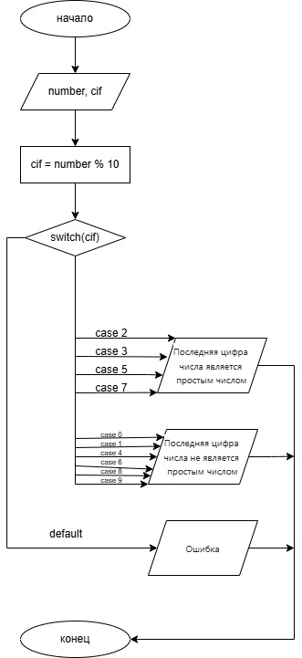

# Домашнее задание к работе 7 
## Условие задачи
Написать программу, которая проверяет, является ли последняя цифра заданного двузначного числа - простым числом
## 1. Алгоритм и блок-схема 
### Алгоритм
1. Начало
2. Инициализировать переменную 
  + `number` - переменная, в которую записывается значение двузначного числа
3. Ввести значение числа с клавиатуры
4. Инициализировать переменную
  + `cif` = `number` % 10 - последняя цифра числа
5. Проверка условия:
  + Если `cif` = 2, 3, 5, 7 - вывести "Последняя цифра числа является простым числом"
  + Если `cif` = 0, 1, 4, 6, 8, 9 - вывести "Последняя цифра числа не является простым числом"
  + Иначе вывести "Ошибка"
6. Конец
### Блок-схема
  
[Ссылка на draw.io](https://viewer.diagrams.net/?tags=%7B%7D&lightbox=1&highlight=0000ff&edit=_blank&layers=1&nav=1&title=blockshemelab10.drawio.png&dark=auto#R%3Cmxfile%3E%3Cdiagram%20name%3D%22%D0%A1%D1%82%D1%80%D0%B0%D0%BD%D0%B8%D1%86%D0%B0%20%E2%80%94%201%22%20id%3D%22aj79lTrdRjpPKqFaR-8Q%22%3E7Vxtc6M2EP41nrn7YA%2FvLx%2FtxOl1pndzrafTXr8ptmxzB4gCTuz79ZWQZAskYsc2kNQkMxgWSYjdZ1e77MLAvIu2v6QgWX9GCxgODG2xHZj3A8PQNd%2FBP4SyoxTX0ShhlQYL1uhAmAU%2FIe%2FJqJtgAbNSwxyhMA%2BSMnGO4hjO8xINpCl6LjdborB81QSsoESYzUEoU%2F8KFvmaUXXHP5z4BIPVml%2FasS16JgK8NbuVbA0W6FkgmdOBeZcilNO9aHsHQ8I9zhja76Hm7H5mKYzzUzq4s2%2FDn8D74%2Fd4Gz19%2BiezvswmQ8ejwzyBcMNumc0233EerFK0SVgzmOZwq%2BI8eOTNNXli%2Bv52MVAgimCe7nATNpBp2LQLw4jFRng%2BMNzUWZO1wGuXXwowIa%2F2Qx%2FYgHcYJ17BFVPiAVxgWLBDlOZrtEIxCKcH6gQzKV5AMqqGjw5tfkMowUQdE7%2FDPN8xjINNjjBpnUchOwu3Qf436T6y2dE34cz9lo1cHOzYAZ0nmVwtKF4Ue4Y26Ry%2B0LBGcikMQR48la%2BqEgPr%2BhUFeD57ibtlgXsVOeYgXcGc9amIcj%2BJ86Wry5DHzJzcF1ttgFnuuXwfbyfFdipDIgyxFSKif14HOZwloODkMzaEZcHWqs6JYqpVHK4UgqLoXCdERbGa0hNDzckx49iBq3bBVecN85BB0fFk49MuT%2B3e9rCGVhu2R3faNT6WpDLxJnqE6cC4I4tpsJTEj%2F2GhOxixoIwhCFapSDC%2FE9gGuDZ4K6Vc18PJ46p1TLYQu51talmnWuZJ7H5VrXMaUPLJEE2rGWOpGWFZmnFvsY1Ds8JT1PjsYYAhrKo38jatDdV3a3372ZxwnxPd7ST7ric8E08e%2BhYHJV6Cia0HS1k4SRVi5eWD02NmAvVFYetJaiZ7mn6Ok5TsBOaJaRBdrJZ4Jc5YJIOeFVbYLwbWy%2BAVrNLmB05rtPj9jhuLb0V3PLLPNRNy36xfTM4d7p9aiGg%2FID5Yzgvg9w%2BAvE3g2bnKo9FTgYhd6KcGtTx2FVrAWW%2B5Fllz0E%2BX3%2FADtZH2Y9ao%2Bhxk3XoQ3H%2FqOqIij6U3qYPZSoeP0l6Gy%2FG5OE1PpqHIMuCeZlbZa0Vl42KrzPyba%2F9dUMWhsBtW8FsTrtu0CEtBlT%2FpcVAsapYI1%2F8s8rjGv7IsbT9X2WeDS05ZgvKbcoP9OYgg5giYxQral5GpUrFszxFP%2BAdChGBVoxiWDx1CMMKCYTBKiZwx%2FgqHlwQUxDMQThmJ6JgsVCsWI3ZDa%2Fiqdqy3XAUSDYbMxtySHtFs%2BEbZbNhWmYX7ubZbmQn9sX0z7YvRwZq%2BOmI6dapuexC3piau12ruZyPZaKRH73cmGj8rkUju75MNO6Ni2bvaHUlGqfT55J8%2F1Whr%2F7GQl8e7xxdgg01MhoKfXmJiF4tEXn5AUy1vdtGaMxZWHLRnJAYgiwBcQmfzr8bUvczmVNNHxMOrh4%2FkOCQ5AFNm%2F5a2sdC%2BNoSxflwCaIg3NHWQ5AkIRxmuyyHEW08CYP4x2cwnxW0B0QYQuj4aiAi9oZdcwZXiJitP3%2BtnlG3%2F4Iw8g1tBuJM3eETDJ8gMUj0cJwGIKS7Ge4zzLCXuFQPPSY3genU4BnaNELfg9NmJd5FTb%2BCc8QUD5kFHRcyACkdVXsE8x%2BrwgwMK3IwbCYAcYeKwtnPylmx30LEy4LfChEXossKI0KG17Vkqx4IK7r%2FwEsn9IGnC%2BUndrG1eEkFPvvAtobGaivIKa%2FYt4qtxmpYOFfixywR5oshTqdcvg1MpmAtkxfBU5XUY7rH9HFM74upPAnTGscuBb3BT%2B0ptGrI4B0p3Hs092ju0EJPHgTjOhWgSWFK29xxZNdBf8qbnYNeTFYAuEqt%2BMP%2FjyqiujT1sYqIapHX9SIPRU3j24w8mo8gmqkVllx%2F3x%2FZrT4us1QZm37V6FeN3q%2FvMX2rmD7q1wu1%2F72b34P7XYG7d%2FM7flmg4vJ17uZbcmGE7PefmX0fmKcXJ1%2FqxB9PsNc48d0U8FQTRqcn2N2R4Qr%2F1RDCHOme8G%2BeFE9cWsHjtZGDMFsC6shoOmX1zrBafYn1ZKxWwVkFfUNo9NtAo90WGnswqoR7ORhPfG%2FrQjDaraRn5aqnRsCo91BUiPZyKNrtQLGNOlvrhK9unF%2FMaVhl2%2BhZ7hFIdlTM%2BaZwWv2YyMk4tY4M1PDTaVvl8b0uEvZqAmFW3qbVxq8VyN5Y1ZviddxWq974l4aak7zeS14p%2Ba6rhG2VX31VyVu95JWSV3y4ol3Jt%2BTEaiO3D6lKy%2Fq5L5P52sg0hXfJjOqwI1cT%2FtpNbdsqR%2FSqhsTpDYnSkHT9NoMtv81wZcl7veRVkt8HxJ29LFFfpn4lyfu95JWS7%2Fw1mfpCpiKnqBB8fdL2SPp1CeblkV6RJxczyuS4lPd%2BXZ67Jq9dvco%2Bb72%2FKY0lou9FoqkvDZN8T6bu5mvLC%2Bpyz1dKfZMSI5ql9ngqGm914WuMYhBfk22uyU3fXLrZ7jzd7MiR%2FQIuwSbMb82EmsdF064JvXr8NbgojOoqOjIqldjOuY%2F5q%2BW90kBnR0D48PBxbdr88I1yc%2Fof%3C%2Fdiagram%3E%3C%2Fmxfile%3E)
## 2. Реализация программы 
```C
#define _CRT_SECURE_NO_DEPRECATE
#include <stdio.h>
#include <locale.h>
#include <math.h>

int main()
{
	setlocale(LC_CTYPE, "RUS");
	int number;
	puts("Введите целое двузначное число\n");
	scanf("%d", &number);
	int cif = number % 10;
	switch (cif)
		{
		case 2:
		case 3:
		case 5:
		case 7:
			printf("Последняя цифра числа (%d) является простым числом\n", cif);
			break;
		case 0:
		case 1:
		case 4:
		case 6:
		case 8:
		case 9:
			printf("Последняя цифра числа (%d) не является простым числом\n", cif);
			break;
		default:
			puts("Ошибка\n");
			break;
		}
	return 0;
}
```
## 3. Результат работы программы 
### Последняя цифра - простое число
Введите целое двузначное число  
52  
Последняя цифра числа (2) является простым числом
### Последняя цифра - не простое число
Введите целое двузначное число
24
Последняя цифра числа (4) не является простым числом
## 4. Информация о разработчике 
Вильальба Агния, группа бТИИ-251
